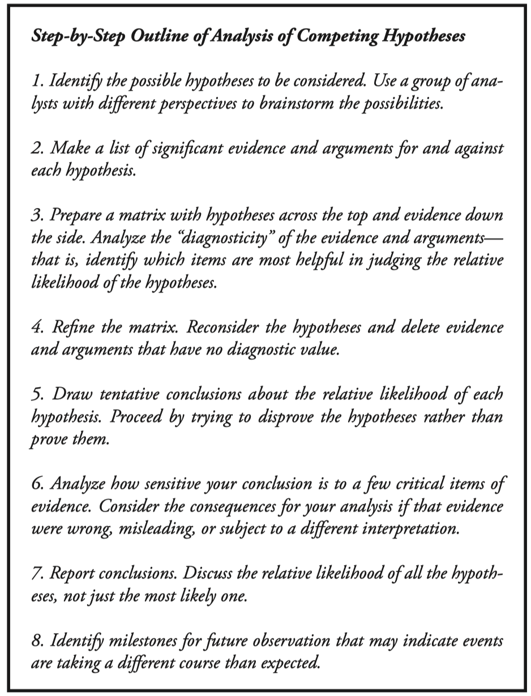
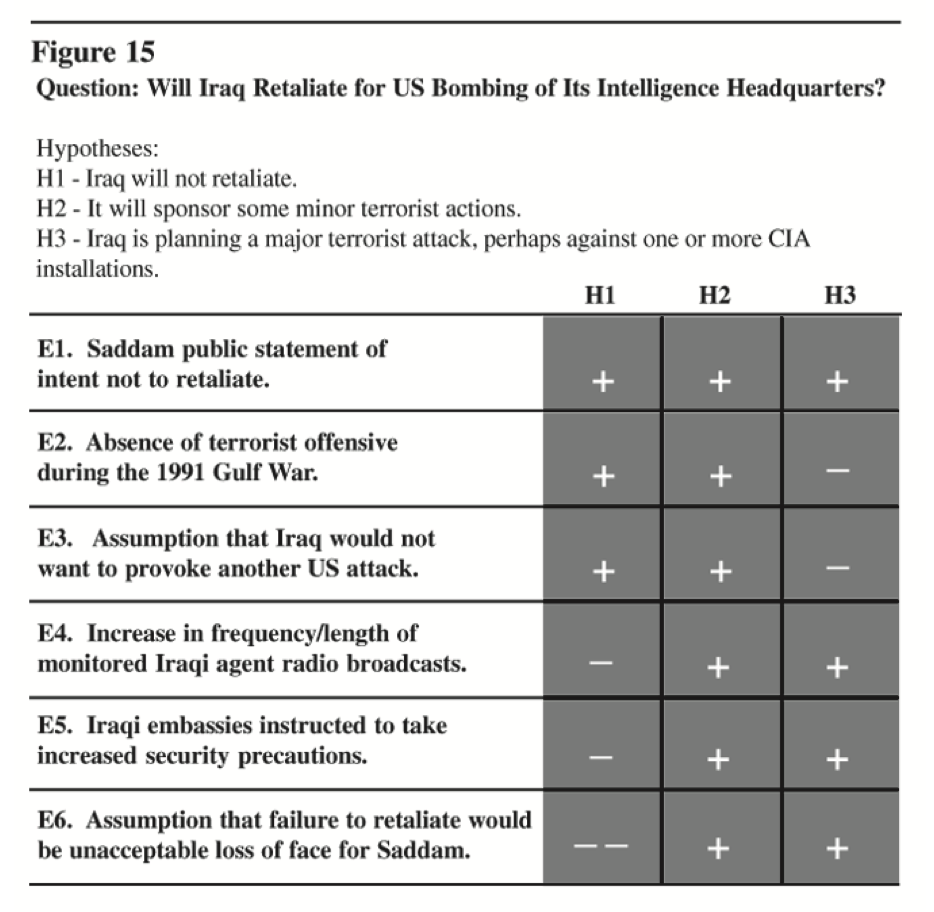

# Competing Hypotheses

A tool to aid judgment on important issues requiring careful weighing of alternative explanations or conclusions. It helps an analyst overcome, or at least minimize, some of the cognitive limitations that make prescient intelligence analysis so difficult to achieve.

ACH is an eight-step procedure grounded in basic insights from cognitive psychology, decision analysis, and the scientific method. It is a surprisingly effective, proven process that helps analysts avoid common analytic pitfalls. Because of its thoroughness, it is particularly appropriate for controversial issues when analysts want to leave an audit trail to show what they considered and how they arrived at their judgment.

## How it works

An example of a working ACH is:

## Fog of War Competing Hypotheses

### Questions

| Question No. | Question |
| --- | --- |
| 1 | Security in the cloud is unorganized and individual based something needs to be created that allows organizations to incorporate valid security into their operations |
| 2 | Does the cloud always provide the best security or are there instances when you need to take it upon yourself |
| 3 | For a solution to be successful it must approach a problem in a unique way and be underpinned by a more robust algorithm or mathematical basis | 
| 4 | What is security in the cloud | 

### Hypotheses

| Hypothesis No. | Hypothesis |
| --- | --- |
| 1 | Tensorflow and similar need to tag data sources to measure their impact on outcomes |
| 2 | Key tension exists - many systems a failure exposes data, but data availability is **NOT the Core Requirement** |
| 3 | Difference in systems - (a) data paramount and must be saved (b) system data is idempotent, data transformed via process and ouptut provided |
| 4 | System of Record (SOR) versus Line of Business (LOB)   LOB System  == idempotent, process orientated   SOR == stateful, the state itself is the key component   LOB == Integrity/Availability   Confidentiality/Integrity   Pick only 2 |
| 5 | (Sinking Ship Approach) Sharding & App Layer - systesm shard data across noeds to increase performance and reslience to hardware failure, but sharding is transparent to most app layer stuff.  What if the routing agent between shards looked at queries and when you sucked up all the records on a shard based on pattern recognition, in agent, it killed your query key / crypto key to the othe rshards so you lost records 1-99, but 100 -1,000 are safe. Downside is suffer in performance and removes strict parallelization. |
| 6 | Auth Risk for data access based on the app and action |
| 7 | Secret Service and Glass Crystal - destruction of specific sensitive data upon a trigger or set of triggers being set off. | 
| 8 | Scale - so much data and the capacity to use it requires equal size as the place stolen from.  |
| 9 | Philosophy for Data - Utilitarian or Triage - protect and save, let others die. |
| 10 | Reciprocal data agreements between organizations to have independent stores that can be used to rebuild upon a protective destruction action |

